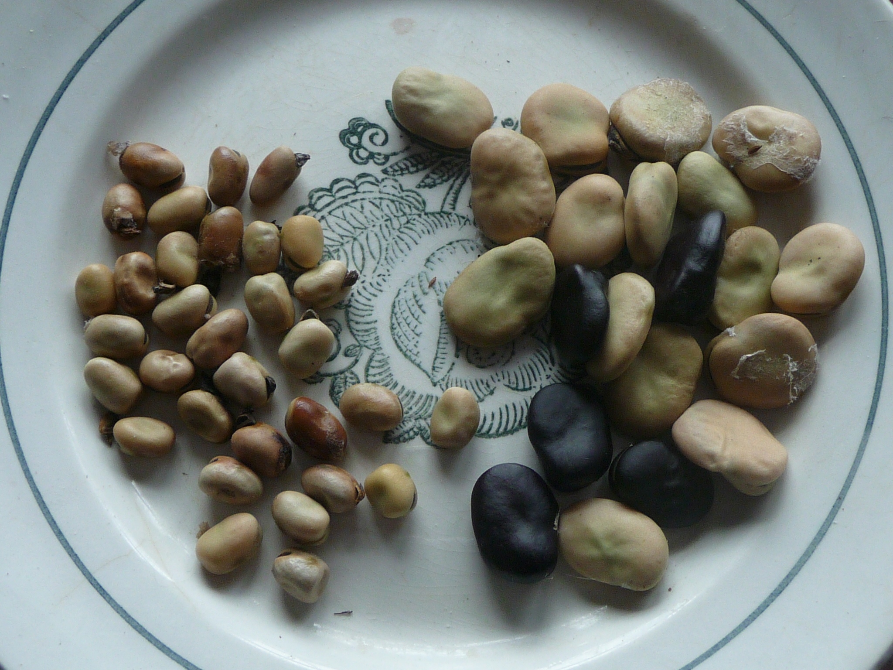

# Выращивание бобов

**[⬅️ К началу](../../HOME.md#разделы)**

**[⬅️ В раздел сельское хозяйство](./index.md)**

 

## БОБЫ

Бобы древняя культура и до недавнего времени весьма распространённая в бытовом питании не богатого люда. Незатейливое, но очень питательное кушанье. Но сейчас бобы в продаже вы не найдёте, да и народ сильно разбалованный всякими деликатесами. А меж тем, эта культура, в условиях простой, общинной жизни, позволяет обеспечить некоторую часть простого питания.

У нас в общинной жизни, бобы сыграли большую роль. Мы в эту деревню приехали совсем без денег, да и потом жизнь нас ими не баловала, так что приходилось выживать тем, что сами выращиваем, ну и по мелочи, что смогли купить на скудный доход. Вот когда, пять лет назад нам подарили бычка и мы привели первую корову, то пришлось уже зимовать с ними на месте, не выезжая зимой на заработки. И вот из питания у нас были много овощей, зерно, купленное у соседнего фермера (благо пшеница была озимая и с хорошей клейковиной), ячмень, выращенный своими руками и бобы. Вот всю зиму мы и питались этим, благо у нас есть жернов и мы могли делать муку и крупу.

 

Но интересна сама история появления у нас семян бобов. Вообще семена бобов в наше время достать достаточно сложно. Можно конечно, но в очень не большом количестве. На рынке у бабушек- за стопку семян 30 рублей было, а в стопке несколько штук. Сейчас продают в садовых магазинах, опять же в маленьких пакетиках, по нескольку штук в каждом. Чтобы размножить бобы до количества, необходимого для свободного потребления, нужен не один год. А нам повезло, свой килограмм бобов я нашёл в мусоном баке и мы смогли за два года размножить бобы до двух бочек, по объёму. Вот и ели мы их не один год. И сейчас едим с удовольствием, конечно от новых урожаев. К этому можно добавить, что готовить бобы можно не только зрелыми семенами, но и не зрелыми стручками, как спаржевую фасоль.

Агротехника выращивания бобов описана в прилагаемом документе, здесь я хочу показать вам фотографии наших бобовых посевов, где представлены как большие белые Белорусские и Русские чёрные, так мелкие кормовые или конские бобы. У конских бобов стебель выше и толще чем у крупных бобов, да и стручков намного больше, а так они все выращиваются по одной технологии. Но единственное, что хотел отметить в агротехнике, так это то, что жать бобы нужно до того как они окончательно высохнут, иначе они прямо на грядке начнут сами лущиться. Пока они ещё сыроватые, срезайте их серпом и ставьте стоймя в копны, можно кучками опирать на рогатки, воткнутые в землю. А когда они высохнут окончательно, то можно и обмолотить или лущить руками.

Но есть вопрос где взять семена? Мелкие, конские бобы я покупал в садовом магазине, их продают большими пакетами по 500 гр. и 1 кг. на посев сидератов. Если вы их там найдёте, то это будет проще всего и дешевле. А так все эти сорта бобов вы можете заказать у нас. Оплата только за почтовый пересыл и всё. Выращивайте в своём регионе и передавайте семена другим.

<a href="../../docs/Vyraschivanie_bobov_Sbornik_statey.docx">Скачать сборник статей о выращивании бобов</a>

**[⬆ Наверх](#выращивание-бобов)**
