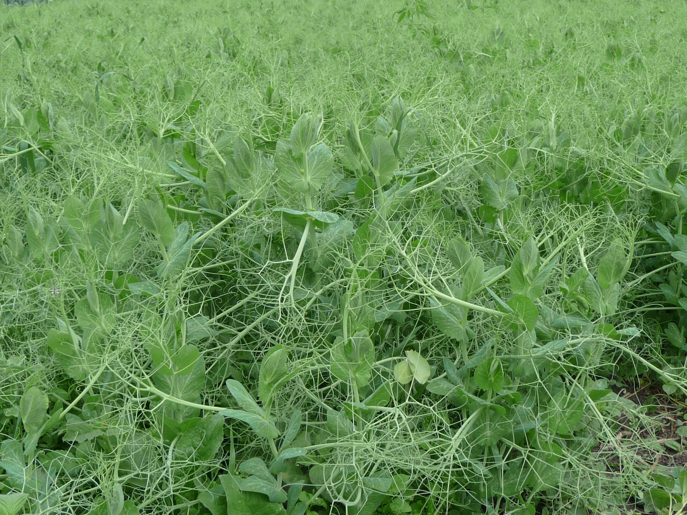

# ВЫРАЩИВАНИЕ ГОРОХА

`Михаил Чибисов` 

**[⬅️ К началу](../../HOME.md#разделы)**

**[⬅️ В раздел сельское хозяйство](./index.md)**

 

Пришло время поговорить о такой бобовой культуре, как горох. В культуре существуют сорта сладкого горошка, который потребляют в свежем, не сушёном виде и сорта зернового гороха, который мы обычно варим. В принципе способы выращивания обоих видов гороха одинаковые, но время жатвы и обмолота разные. И я думаю, что со сладким горошком в целом всем понятно, а вот зерновому гороху хотелось бы уделить особое внимание.

За свою бытность я встречал два вида зернового гороха, это кустовой, низкорослый, с зелёным зерном и плетистый с жёлтым зерном, который мы обычно едим. Опять же в агротехнике выращивания обоих видов гороха я не наблюдал, некоторую разницу можно обнаружить только в технике жатвы. Но в данном случае я выращивал жёлтый, высокорослый горох и поэтому буду рассказывать о нём.

Что характерно для всех бобовых культур, так это то , что они обогащают почву азотом и потому их полезно садить в настроении сидерата, для удобрения почвы. И что касается удобрения почвы под бобовые культуры, то здесь важно не особо усердствовать, иначе растения пойдут в ботву и созревание зерна будет задержано.

Следующие, это то что подготавливать почву под горох нужно так же как и под зерновые культуры.Основной упор нужно сделать на борьбу с сорняками. В этом случае горох следует высаживать либо после пропашных культур, либо по парам, что бы предварительно, многократной обработкой почвы, можно было избавиться от засорённости сорняками. Дело в том, что такие культуры, как бобы и фасоль можно легко пропалывать в связи с их крупностью, а вот горох, в процессе роста сплетается меж собой и тем самым очень затрудняет прополку. В начале роста горох ещё можно прополоть, но в дальнейшем, это становится затруднительным. Тут ещё накладывает отпечаток сроки посева гороха, который нужно сеять в ранние сроки, для того что бы хватило влаги для набухания семян. И по этому у нас не будет возможности подготовить почву под посев гороха по методу Т. Мальцева под посев зерновых культур.

Семена гороха я брал в садовом магазине, там их продают в больших упаковках по 0,5 - 1 кг.на сидераты. Другой сорт гороха я достал в НИИ селекции в Кемерове.

Дальше нам нужно посеять семена в землю. Сеять нужно тогда когда только почва будет годна для обработки. Семена гороха достаточно крупные и им для роста нужно больше влаги чем зерновым и это в большей степени относится к засушливым районам. Сеять лучше рядовой сеялкой на глубину 3 см. или хотя бы делать борозды, а за тем сеять руками, но это намного дольше и труднее, чем сеять сеялкой. В разброс я сеять бы не советовал, потому что семена заделать вам, в этом случае равномерно не удастся, часть из них просто останутся на поверхности при первом же дожде оголятся. Итак сеять лучше рядами, потому что семена можно положить на одинаковую глубину и равномерно по расстоянию друг от друга. И соответственно с этим мы можем наметить проходы между группами рядов для более лёгкой обработки посевов. Раньше я сеял горох рядами группами по три ряда, но горох высокорослый и поднявшись в высоту валиться на бок под давлением ветра. В этом году я посеял его в четыре ряда, это видно на фото и устойчивость усилилась. Он упал конечно, но только к периоду созревания и не так сильно. При посеве располагать ряды лучше с севера на юг, так освещение растений будет равномернее и соответственно урожай повышается. Борозды прокладывать нужно с расстоянием между ними не менее 15 см. и между группами рядов по 4 шт. нужно делать проходы по 30-40 см.

В дальнейшем достаточно просто пропалывать посевы до тех пор как горох поднимется и сделает прополку не возможной, ну разве что руками.

На фото показаны этапы роста, цветения и образования стручков. А дальше, когда стручки начнут буреть, нужно приступить к жатве. Нужно срезать плети серпом или выдёргивать руками с корнем и собирать охапками. Втыкайте в землю рогатины, как опоры для сушки охапок, которые устанавливайте вокруг рогатин на корень. Сверху группы охапок нужно положить то же охапки, но корнем верх и к середине. Это закроет всю конструкцию от дождя.

Когда горох просохнет, в солнечную погоду, можно приступить к обмолоту. Можно обмолачивать с помощью механической молотилки или на току, гумне и риге батогами, а можно просто на таком столе - молотилке, как сделал я. Затем обмолоченную массу нужно провеять на веялке или ветру и горох готов к употреблению. Урожай у меня составил около 30 кг. гороха с сотки, но думается, что это не предел.

Можно сказать пару слов и по качеству выращенного своими руками гороха, по сравнению с покупным. По вкусу и качеству, это две разные вещи, как небо и земля. Свой горох и вкусный, и нежный, и переваривается великолепно, по сравнению с фермерским, который в желудке ложиться колом и без большой дозы перца не переваривается.

Подробно о промышленной агротехнике выращивания гороха вы можете прочитать в прилагаемых документах.

<a href="../../docs/Tekhnologia_Vyraschivania_Gorokha.docx">Технология выращивания гороха</a>

<a href="../../docs/Tekhnologia_Proizvodstva_Gorokha.pdf">Технология производства гороха</a>

**[⬆ Наверх](#выращивание-гороха)**
